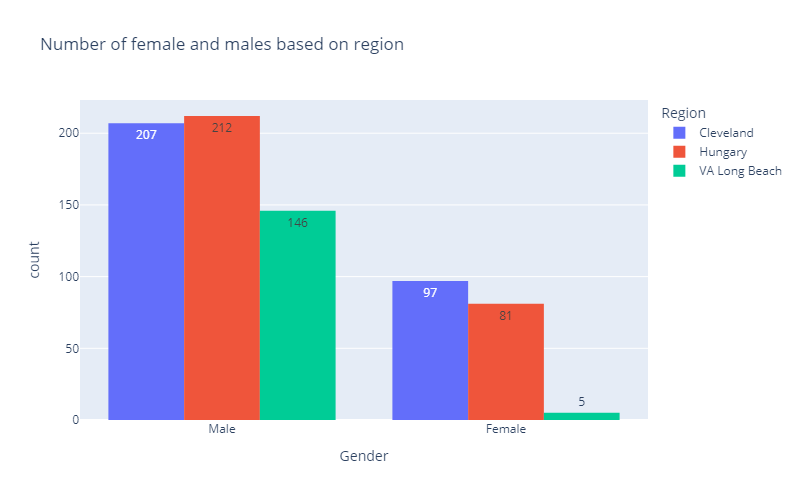
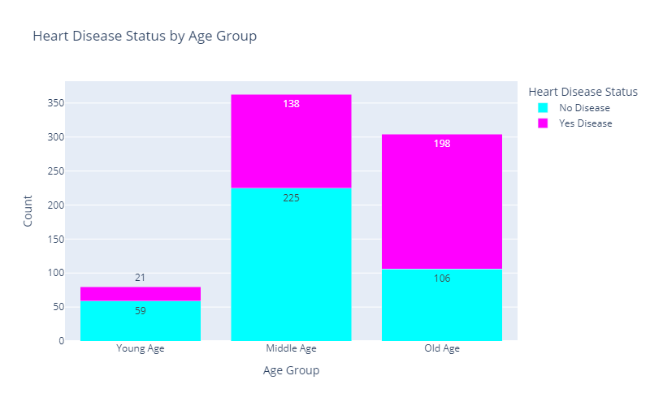

<h1 style="font-family: 'Poppins', sans-serif; font-weight: 700; color: #1c1c1c; background: white; padding: 15px; border-radius: 10px; text-align: center; box-shadow: 0 4px 8px rgba(0, 0, 0, 0.5); letter-spacing: 1px; text-transform: capitalize; font-size: 1.5rem;">
<span style="color: #333333;">Heart disease analysis</span>
</h1>


## Overview:
This project is designed to unlock the potential of heart disease data, **transforming it into actionable insights that can shape healthcare strategies.** By diving deep into the data, we aim to discover key risk factors, patterns, and trends that can lead to more effective healthcare interventions, **improving both patient outcomes and operational efficiency.**

### Key Objectives:

- **Pinpointing high-risk populations:** By identifying which groups are most at risk, healthcare providers can prioritize resources and design targeted interventions, ultimately reducing the burden of heart disease.
- **Proactive healthcare planning:** Analyzing trends in the data can help forecast future healthcare needs, allowing for earlier intervention and more personalized care strategies for at-risk individuals.
- **Optimizing resource allocation:** Insights from the data will help in making informed decisions about where to allocate healthcare resources most effectively, ensuring better patient care and minimizing costs.
- **Strategic policy development:** With data-backed insights, healthcare organizations can refine their policies and strategies, improving the efficiency of treatments and enhancing overall healthcare delivery.

This project aims to provide healthcare providers with the intelligence they need to **make smarter, data-driven decisions.** By aligning heart disease insights with operational goals, the results will enable more **efficient healthcare management, better patient care, and ultimately a healthier population.**

The **SQL** queries used to **analyze** the data can be found [here](https://github.com/Maaz-Umar-00/Heart-Disease-Analysis-Project/blob/main/02_heart_diseases_data_analysis.ipynb).\
The **SQL** queries used to **clean** the data can be found [here](https://github.com/Maaz-Umar-00/Heart-Disease-Analysis-Project/blob/main/01_heart_disease_data_cleaning.ipynb).


## Data Structure & Initial Checks.
The dataset used for this analysis is sourced from [https://www.kaggle.com/datasets/redwankarimsony/heart-disease-data]) and includes the following features:

* `id:` A unique identifier assigned to each patient. It helps to distinguish between different patients but doesn't provide any medical information.
* `age:` The patient's age in years. Age is a key factor in assessing heart disease risk, as older individuals generally have a higher risk.
* `dataset:` The place or source of the study or data collection. This might be useful for understanding geographic variations in the data.
* `sex:` The patient's gender (Male or Female). Gender can influence the likelihood of developing heart disease, with different risks associated with each gender.
* `cp (chest pain type):` Indicates the type of chest pain experienced by the patient:
  - 1: Typical angina - pain due to heart disease.
  - 2: Atypical angina - pain not necessarily related to heart disease.
  - 3: Non-anginal pain - pain not related to the heart.
  - 4: Asymptomatic - no chest pain experienced.
* `trestbps:` Resting blood pressure (in mm Hg) measured when the patient is admitted to the hospital. High blood pressure is a known risk factor for heart disease.
* `chol:` Serum cholesterol level (in mg/dl). High cholesterol levels can increase the risk of heart disease.
* `fbs:` Indicates whether the patient's fasting blood sugar level is greater than 120 mg/dl (True or False). High fasting blood sugar can be a sign of diabetes, which is a risk factor for heart disease.
* `restecg:` Resting electrocardiographic results:
  - 1: Normal heart activity.
  - 2: ST-T wave abnormality, which can indicate heart issues.
  - 3: Left ventricular hypertrophy, an enlargement of the heart's left ventricle.
* `thalach:` Maximum heart rate achieved during exercise. A higher heart rate can indicate better cardiovascular fitness, but extremely high or low rates can be a concern.
* `exang:` Exercise-induced angina (True or False). Indicates whether exercise triggers chest pain, which can be a sign of heart disease.
* `oldpeak:` ST depression caused by exercise relative to rest. ST depression can be a sign of heart disease.
* `slope:` The slope of the peak exercise ST segment:
  - 1: Upsloping - indicates better exercise tolerance.
  - 2: Flat - can be normal or indicative of heart issues.
  - 3: Downsloping - often associated with heart disease.
* `ca:` Number of major vessels (0-3) colored by fluoroscopy. More vessels colored indicates more significant coronary artery disease.
* `thal:` Thalassemia status.
* `num:` Indicates whether heart disease is present:
  - 0: No heart disease.
  - 1: 1, 2, and 4 indicate varying levels of disease presence.
 
3

## Findings and Recommendations

1. **Gender Distribution in Heart Disease**:
   - The dataset shows that `565 males` and `183 females` were recorded, indicating a higher prevalence of heart disease among males.
   - This suggests that healthcare interventions should focus more on male populations, especially in terms of awareness and early screening programs to reduce risk.

   

2. **Age Distribution and Heart Disease**:
   - `Middle-aged` and `older` individuals have the `highest rates of heart disease`, which aligns with expectations since the likelihood of developing heart disease increases with age.
   - Preventative healthcare strategies should focus on these age groups by promoting regular heart health check-ups and early lifestyle modifications to lower risk.

   

3. **Impact of Age on Blood Pressure and Cholesterol**:
   - It was found that as `age increases, both resting blood pressure and cholesterol levels tend to rise`. This could explain why `middle-aged and older individuals have a higher risk of heart disease`.
   - Healthcare providers should emphasize regular monitoring of blood pressure and cholesterol in older populations, offering lifestyle interventions and medications as needed to control these risk factors.

   


## Installation
To run this project, you will need to have the following installed:
- Python 3.x
- Pandas
- Plotly
- Matplotlib
- NumPy

You can install the necessary libraries using pip:
```bash
pip install pandas plotly matplotlib numpy
```
## Conclusion
Through this analysis, we aim to provide insights into heart disease trends and risk factors. The findings can be beneficial for healthcare professionals, researchers, and individuals interested in understanding heart health better.

## Acknowledgments
- [Kaggle](https://www.kaggle.com/datasets/redwankarimsony/heart-disease-data) for providing the dataset.
- Plotly and Matplotlib for their excellent data visualization libraries.

